# DEISI25-Aws-Management-Portal

## Installation and Deployment

### Pre-requisites
- AWS Account with ROOT access (create one [here](https://aws.amazon.com/))
- Github Account
- Docker (download [here](https://docs.docker.com/get-docker/))

### Steps
#### 1. Getting the AWS Root Account Access Key
Navigate to [https://aws.amazon.com](https://aws.amazon.com) and login with the ROOT accout.

In the top-right corner click in the account username and select __Security Credentials__.
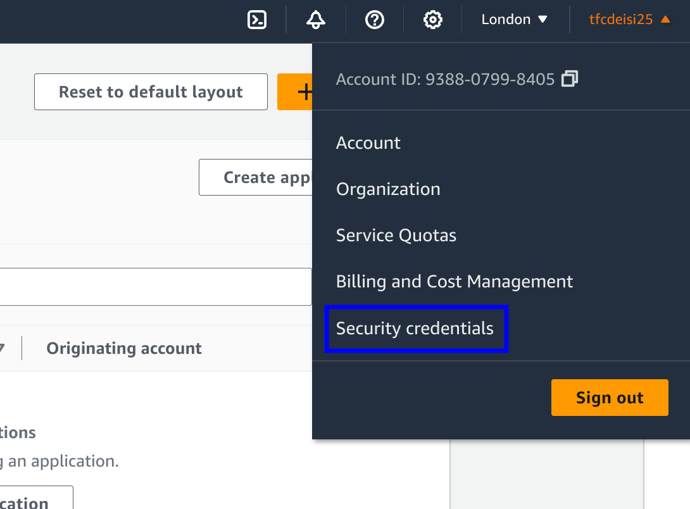

Under __Access Keys__ select __Create access key__.
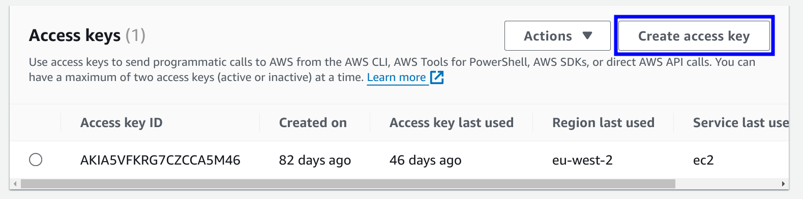

Take note of the __Access key__ and the __Secret access key__ as they will be required in the setup script.
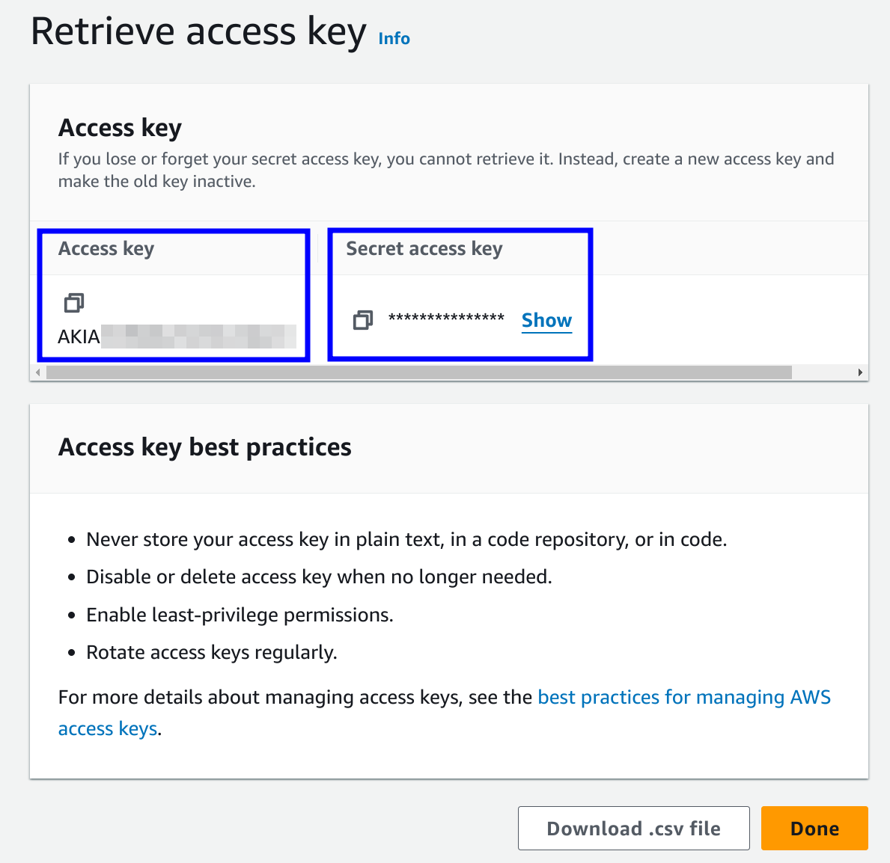

#### 2. Create the `docker-compose.yml` file.
Open this [file](https://raw.githubusercontent.com/al3x-13/DEISI25-Aws-Management-Portal/main/docker-compose.yml) and
copy all the content inside and save it locally to a file named `docker-compose.yml`.

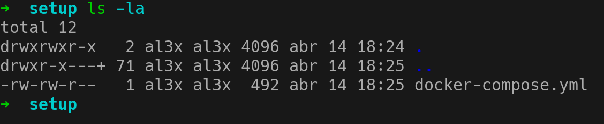
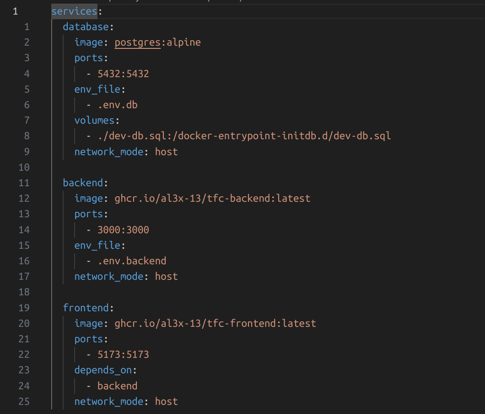

#### 3. Download Setup Script
Go to [this page](https://github.com/al3x-13/DEISI25-Aws-Management-Portal/releases/tag/v0.1.0) and download the binary
that matches your operating system. Save it in the same directory as the `docker-compose.yml` file.

Make sure the binary has `execute` permissions.
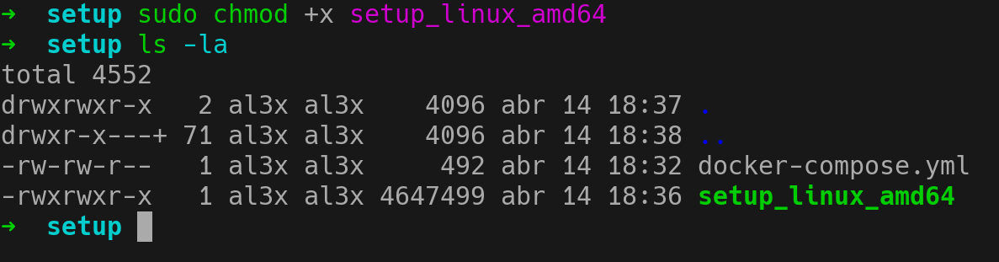

#### 4. Execute Setup Script
Execute the script and insert the requested info. These info will be used to create the config files the application
requires in order to run.
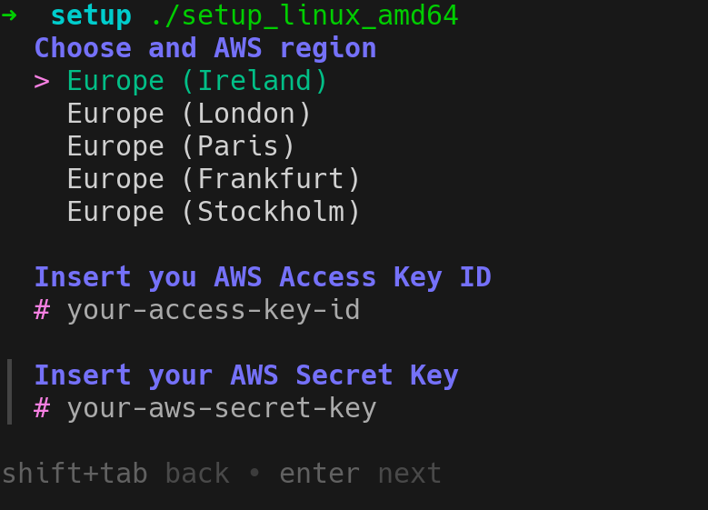

This is the output of the script if it ran successfully.
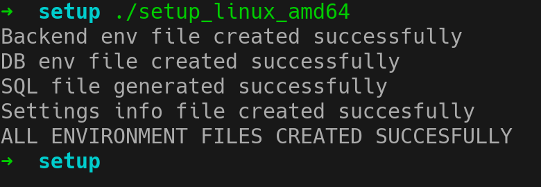

This are the files it generated.
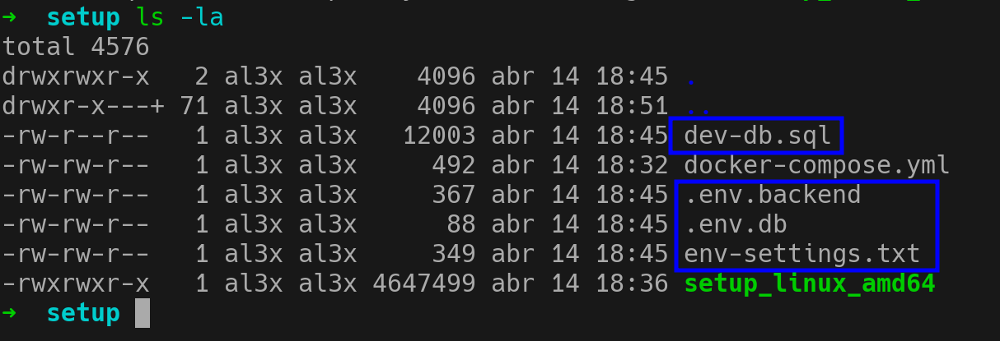

__NOTE:__ In this script you'll be prompted to create password for 2 users (a ROOT user and a STANDARD user) that you can use to
test the application. This is temporary, while the user management functionality is not finished.

#### 5. Login to GHCR from Docker
In order to be able to pull the containers, we need to login into Gitub Container Registry (GHCR) from docker.

First we need to create a Personal Access Token (PAT) with the required permissions. To do that navigate to the
following page [https://github.com/settings/tokens](https://github.com/settings/tokens) and select `Generate new token
(classic)`.
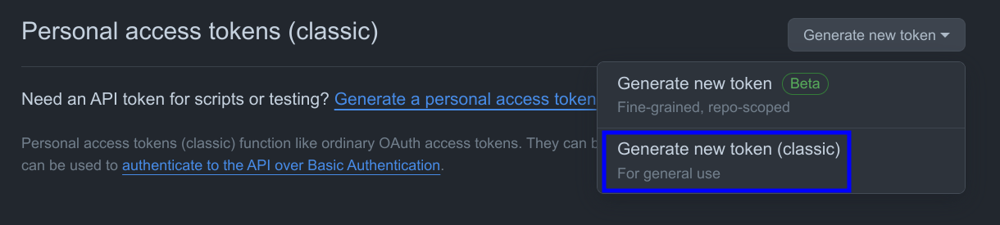

Then select the options `read:packages`, add a note (does not matter what) and generate the token.
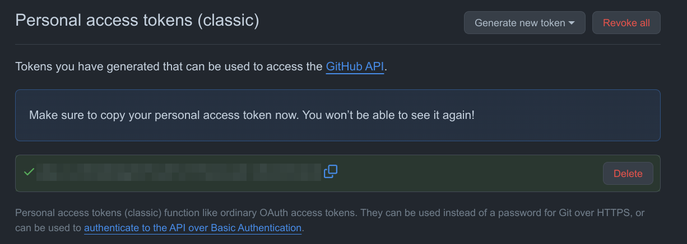

Copy the generated token, and then, in the terminal execute the following command `echo "GITHUB_TOKEN" | docker login
ghcr.io -u GITHUB_USERNAME --password-stdin` replacing `GITHUB_TOKEN` with the generated token.
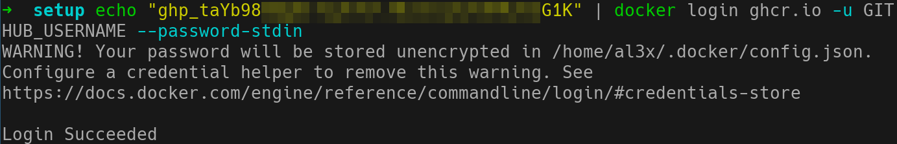

#### 6. Run Docker Compose
To run the application we just need to run the following command on the terminal.
`docker compose up --build`

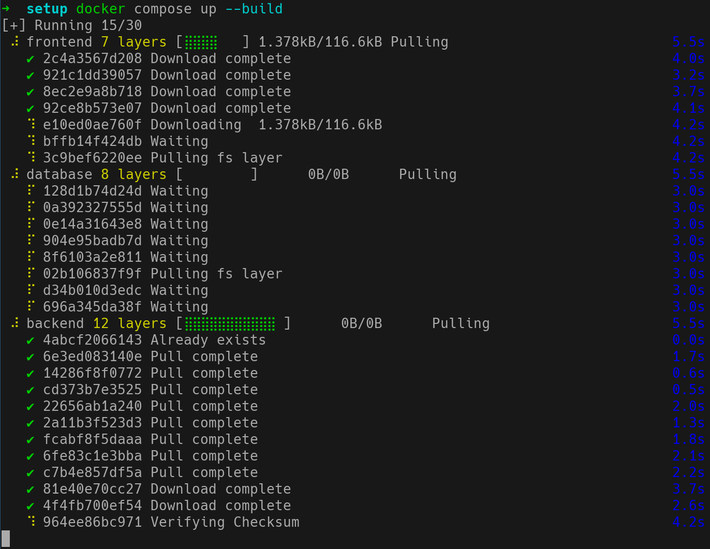
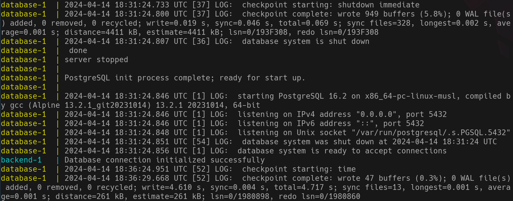

If no error was thrown, the application should be running.

#### 7. Ready to Go
To make sure the application is running, access the following url in the browser:
[http://localhost:5173](http://localhost:5173).

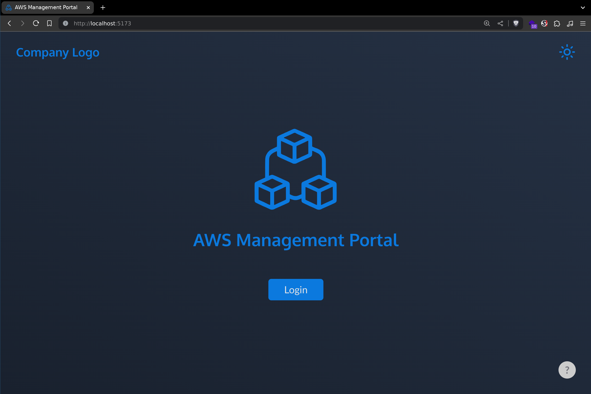

Now, you're able to login using the accounts setup in the setup script and test the application.